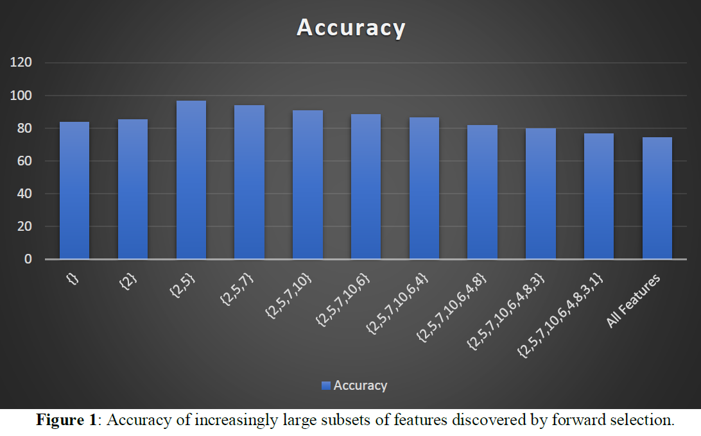
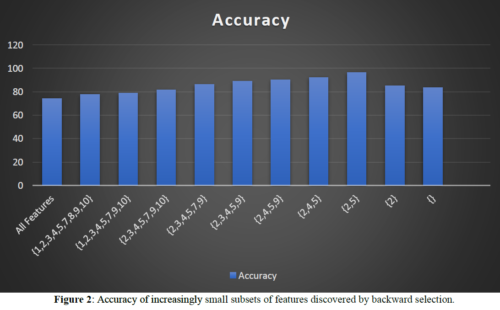

# Feature Selection Project - Artificial Intelligence
### Implementation of the Nearest Neighbor classifier to enable Forward Selection and Backward Elimination search algorithms

In this project, the nearest neighbor classifier was implemented, and then using it inside a “wrapper” which does various kinds of searches such as the Forward Selection and Backward Elimination.

In Figure 1 we see the result of running forward selection on small.txt, which was the small file pre-generated.

At the beginning of the search, we have no features (denoted by {}) so I reported the default rate, which was 83.6%. Adding feature ‘2’ minimally improved the accuracy to 85.2%, and then adding feature ‘5’ dramatically improved to an accuracy of 92.3%. When we then added feature ‘9’, the accuracy increases, but only by a tiny amount, to 96.6%. Because this is a large gain, I suspect it indeed does reflect a true useful feature. Thereafter, each additional feature added reduces the accuracy, until we have the full set of features, which gives us an accuracy of 74.2%.

Next, as shown in Figure 2, I ran backward elimination on small.txt.

First, a sanity check. The first tested subset, that of all features, should have the same accuracy as the last tested subset in forward selection. With a score of 74.2%, that is the case. Around the end is when we find out that it features 2 and 5 give a whopping 96.6%. Likewise, as we started initially for the forward selection, we end up with 83.6%. For this problem, backward elimination is not as accurate as forward selection. However, because it does find feature ‘2,5’ as its best feature subsets, it gives us confidence that features ‘2,5’ are really good features.

Conclusion For Small Dataset: I believe that features ‘2’ and ‘5’ are the best features for this problem. There is very weak evidence that feature ‘10’ might be useful, but that needs further investigation. If we deploy this {2,5} model, I believe the accuracy will be about 96.6%.
